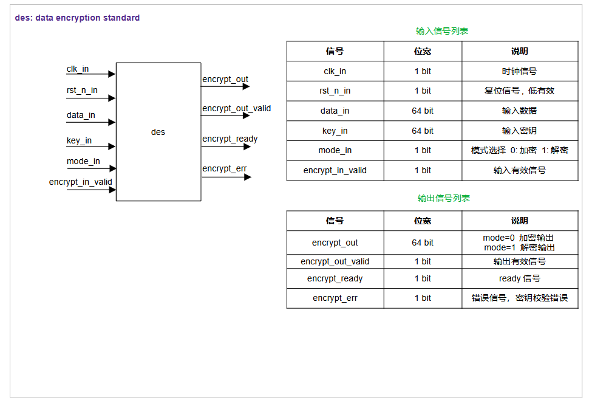
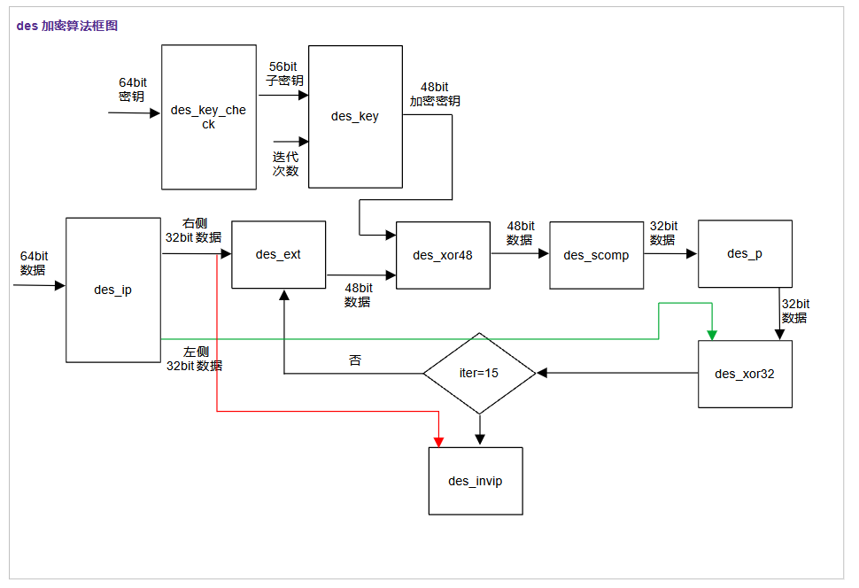
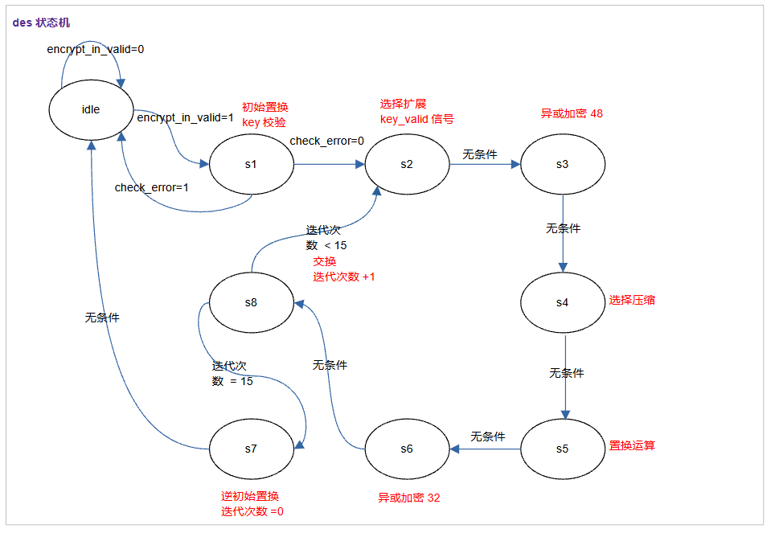
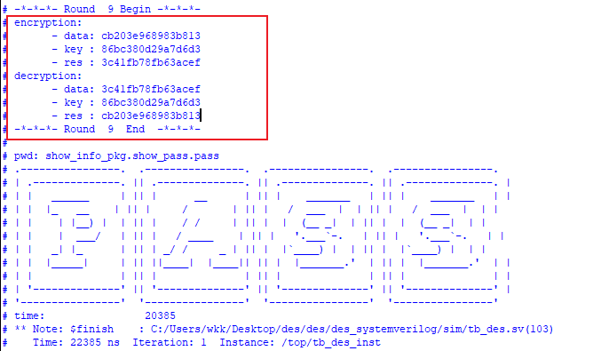
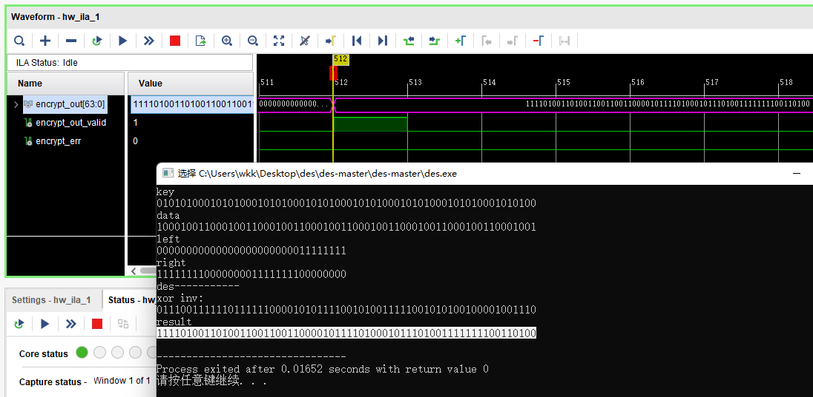
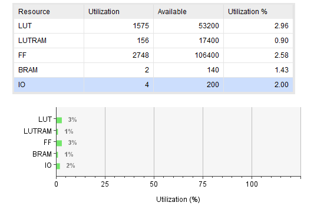

# des-systemverilog

Implement des algorithm with systemverilog.
Reference Model: **https://github.com/wa-kakalala/des.git**

## block diagram

## simulation

## fpga verification

## Utilization

xc7z020clg484-1

## log

- 2023/12/30 des_key_check && des_key  module 's simulation is ok.
- 2024/1/4  des_ip  module 's simulation is ok.
- 2024/1/4  des_ext  module 's simulation is ok.
- 2024/1/5  des_scomp  module 's simulation is ok.
- 2024/1/7  des_p  module 's coding is finished.
- 2024/1/7  des_xor48 && des_xor32  module 's coding is finished.
- 2024/1/7  des_invip  module 's coding is finished.
- 2024/1/7  des_ctrl  module 's design is finished.
- 2024/1/7  des module 's fsm is finished.
- 2024/1/8  des module is finished, but still have some bugs.
- 2024/1/9  fix the bugs and fpga verification is finished.
